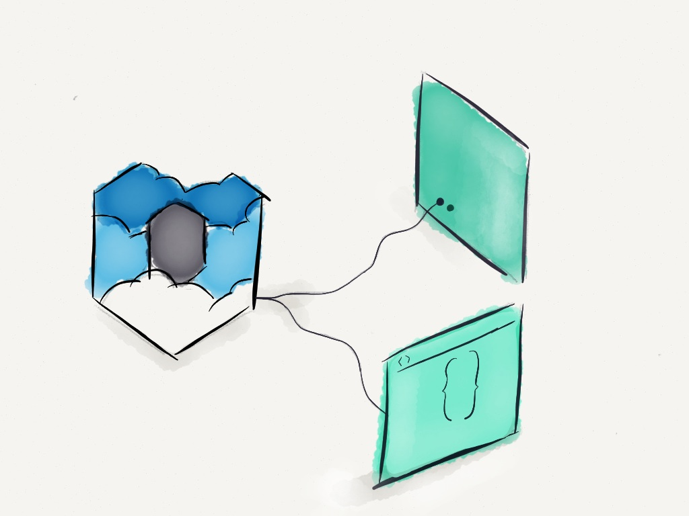

# wolkenkit-client

wolkenkit-client is a client to access wolkenkit applications.



## Documentation

See [Buildling a client](https://docs.wolkenkit.io/latest/reference/building-a-client/connecting-to-an-application) on how to use this module to build a client that connects to a [wolkenkit](https://www.wolkenkit.io) application.

## Running the build

To build this module use [roboter](https://www.npmjs.com/package/roboter).

```shell
$ npx roboter
```

### Testing on BrowserStack

To run the tests on [BrowserStack](https://www.browserstack.com/), you need to define the environment variable `SELENIUM_ENV` and set it to the value `browserstack`.

_Please note that you need to have the environment variables `BROWSERSTACK_USERNAME` and `BROWSERSTACK_ACCESS_KEY` set to your account's credentials._

Running the tests on BrowserStack enables you to test on multiple browsers and platforms. BrowserStack kindly offers this service for free to open-source projects.

[](https://www.browserstack.com/)

## License

Copyright (c) 2014-2018 the native web.

This program is free software: you can redistribute it and/or modify it under the terms of the GNU Lesser General Public License as published by the Free Software Foundation, either version 3 of the License, or (at your option) any later version.

This program is distributed in the hope that it will be useful, but WITHOUT ANY WARRANTY; without even the implied warranty of MERCHANTABILITY or FITNESS FOR A PARTICULAR PURPOSE. See the GNU Lesser General Public License for more details.

You should have received a copy of the GNU Lesser General Public License along with this program. If not, see [GNU Licenses](http://www.gnu.org/licenses/).
